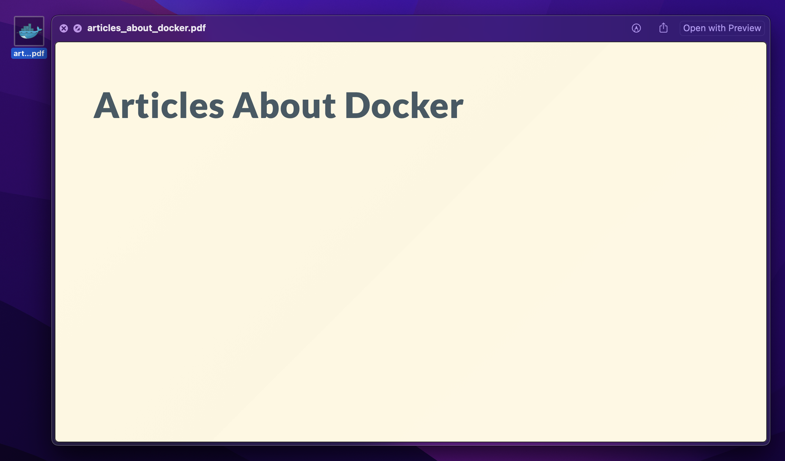

<h1 align="center">Desktop Articles Manager</h1>

<div>
  
</div>

```zsh
$ source setup.sh
$ source main.sh
```

**~/Desktop/articles/articles_about_docker.md**

```md
---
icon: "docker-original"
---
# Articles About Docker
```

> **Note**<br />
> If `icon` is not specified, the `pdf` icon will be displayed.

##  When using Marp

```md
---
icon: "docker-original"
marp: true
theme: "gaia"
---
# Articles About Docker
```

> **Note**<br />
> By preparing your own CSS design file directly under `marp`,<br />
> you can set the file name to theme and that design will be applied.
> ```md
> ---
> marp: true
> theme: "dracula"
> ---
> ```
